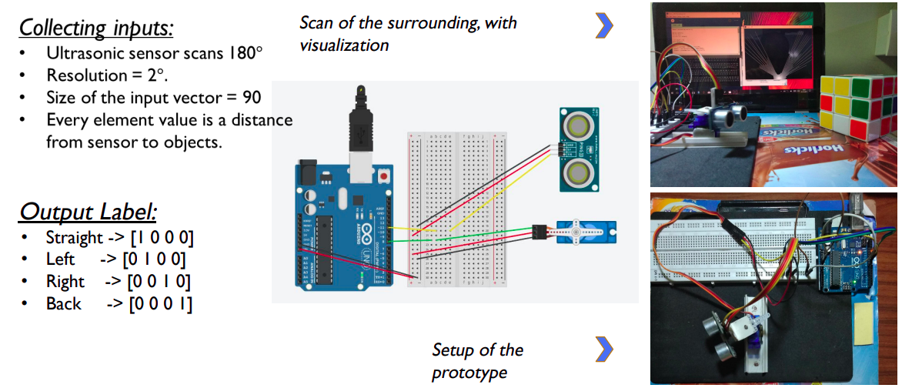

# BEHAVIORAL CLONING FOR SELF DRIVING CARS

## Objective
Exercise and implement Deep learning
methodology for autonomous control of the car.
<ul>
  <li>Study of various deep learning approaches for
autonomous vehicle</li>
  <li>To develop deep learning based model which performs
object detection and avoidance in autonomous vehicle</li>
  <li>Testing and validation of the proposed model</li>
</ul>

## Proposed work
Implementation of End-to-End learning

<ul>
  <li>Neural Net</li>
  <li>Convolution Neural networks</li>
  <li>Training the network (Data?)
    <ul>
      <li>Designing a 1D-distance acquisition sensor</li>
      <li>Designing a robot for driving data</li>
      <li>Training the network on data</li>
    </ul>
  </li>
  <li>Direction classification using Distance acquisition sensor data for object avoidance</li>
  <li>Actuator data prediction using Images for path following</li>
</ul>

## Methodology

## Results
Results and more graphs are available in [report](./report.pdf)